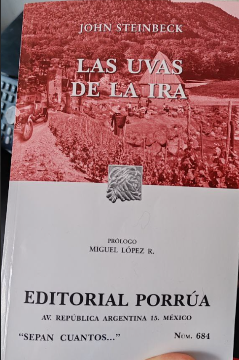

+++
title = 'Las uvas de la ira'
date = 2026-03-01T16:25:16-03:00
draft = false
summary= "Libro / Opinión:  Impresiones del libro de John Steinbeck"
+++

>Good men through the ages tryin' to find the sun
And I wonder, still I wonder, who'll stop the rain?

Creedence clearwater revival
>

### Opinión y reflexión

Iniciaré con el final. John Steinbeck, en el libro, tuvo la particularidad de ir contándonos la historia de la familia Joad, mediante los acontecimientos cotidianos y vivencias de la familia, y además capítulos que describían una situación en específico, una breve historia para ponernos en contexto con la realidad de la historia, relatos descriptivos o escenas cotidianas de otras personas para sentarnos donde John quería que estuviésemos mirando, y John, en el penúltimo capítulo del libro, nos cuenta una breve historia de los acontecimientos que ocurrieron en ese invierno que tanto se avecinaba en el libro, acontecimientos que pasaron en la realidad real y del libro, pero descritos de manera superficial para darnos una idea general de donde nos situaríamos en el siguiente capítulo y luego en el capítulo final, el lector se dará cuenta que el libro finaliza en la primera parte de la historia del capítulo anterior, cerrará el libro con la incertidumbre del ¿qué pasó con ellos?, ¿qué ocurrió con el resto de la historia?, pero luego de dejar asentar el agua turbia y que los sedimentos terminen de asentarse en el fondo, comprenderemos que el final, pudo haber terminado mucho antes en el libro, pero la idea de cortarlo en ese punto, nos deja con el único razonamiento de querer reflexionar; de hecho, de alguna forma sabemos como iba a terminar, podemos ser realistas, tener fe o convertir el temor en ira. Al cerrar el libro, quedé con la sensación de que los cisnes negros existen, nadie está a salvo y solo faltan unas tantas combinaciones de realidades, para que cualquiera se convierta en un migrante, para que cualquiera de nosotros sea un extranjero en su propio país, para que cualquiera de nosotros quede a merced de la compasión de los demás.

Leer las uvas de la ira te permite ver o comprender los acontecimientos históricos (en este caso, la Gran Depresión de los 30 en USA), lo que significa perderlo todo y cómo la expresión “a merced de los demás” cobra sentido. Siempre he sentido que permitirse ser amable un poco más de la cuenta, podría estar ayudando a alguien sin saber que lo necesita, digamos como un por si acaso, razón por la cuál trato de no juzgar la violencia que uno vive en esta ciudad, no hablo precisamente de asesinatos o agresiones físicas, hablo de la violencia más genéricas, más pequeñas, las miradas amargas, la impaciencia, el estrés de todos nosotros sobreviviendo nuestras realidades que no escogimos tener desde que nacimos (nadie escogió nacer en los 40, 90, Etc.) Violencia en un matiz que no se nota hasta que alguien nos pide ayuda en la calle (personas en situación de calle, vagabundos, migrantes, personas buscando trabajo, Etc.) y nuestra propia libertad nos permite no ayudar, y me lo cuestiono mientras escribo, recordando las varias oportunidades donde yo pude hacer un poco más. 

Las uvas de la ira, trata justamente de esto, si la mayoría de nosotros no escogimos la realidad que nos toco vivir, si podemos escoger como afrontarla: podemos obviarla, aceptarla o tratar de luchar contra ella; trata de buenas personas, que aceptan su realidad y quedan a merced de la piedad o compasión del resto del mundo, cuando su propio mundo se termina y deben cambiar de realidad. El libro escribe y describe a la familia Joad afrontando con entereza y humildad el cambio que les traerá perder su identidad, como tienen que adaptarse a una nueva vida porque el sistema ajusto las reglas del juego a su ventaja y no del resto; y ellos se vieron afrontados a dejar su granja, su estilo de vida, su hogar y emigrar a un futuro incierto, a un lugar de promesas y enfrentar una violencia nefasta, que como diría Zizek, mas violenta que la propia agresión o muerte, una violencia que hiere por dentro, quitándole piso a la dignidad de la condición humana, fomentada por miedos y prejuicio pero sobre todo por miedo, miedo a un cambio de realidad, miedo a que cambien las cosas, miedo a que ellos (emigrantes, otros, cualquiera menos nosotros) nos puedan cambiar la vida.

Este libro me trajo recuerdos, de documentales en tv abierta sobre inmigración, de cómo esta vulnerabilidad es explotable y desechable, me recordó volver a escuchar la entrevista de latinoamericanos, de sus tierras, enviando el dinero que ganaban a sus familias; recordando también migración de personas que debieron dejar en Chile sus tierras por sequías, viendo como su ganado moría por no tener agua o comida para ofrecerles; me recordó que desde pequeño crecí con las diferentes migraciones y como nuestras realidades se iban habituando a esta realidad, recuerdo en mi infancia los peruanos y ahora después de varios años, son venezolanos, e incluso ahora existen migraciones estacionales, donde (tal como en el libro) se contratan temporeros en Bolivia para que vayan a trabajar al sur de Chile y pienso, y recuerdo que mi familia, por parte de padre emigro de comuna en comuna hasta que se estableció en Pirque, y pienso como por parte de mi madre, emigraron desde la ciudad de el Salvador (norte de CHIle) a la comuna San Bernardo (Santiago); pienso en la familia de mi esposa que viajaron desde Valparaíso a estación central y solo pienso en cuando me tocará a mi.

Vivo en Santiago, donde ahora viven siete millones de personas, casi un 40% del total de Chile, pienso en como afuera de Santiago, cuando es verano y temporada alta, como se refieren a los santiaguinos por como somos de acelerados, mal portados y con poca educación, pienso en que se necesitaría para que Chile se tuviera que transformar para desarmar Santiago y repartirlo en todas las regiones y en como cada vivencia descrita en el libro volvería a repetirse (Ajustada a nuestros años) gente viviendo en las calles, gente colapsando los hospitales regionales, como se formarían campamentos que serían desalojados; no se necesita una guerra para desplazar gente, sólo se necesita una crisis económica, con la codicia por detrás o un desastre natural, para que Santiago sea inviable, no se necesita mucho para que cualquiera de nosotros tenga que volver a comenzar.

Para cerrar, lo que amé del libro es la calidez con que podía imaginar los desayunos y las comidas en general que se describían en él, un amor cálido ante la incertidumbre, el cariño de una madre y la dignidad que se requiere para enfrentar las cosas con entereza, sin perderse a uno mismo. Recordé a abuelos, tíos y tías, que ya no existen, me imaginé cada instante del libro, viajando en esta travesía a un futuro incierto, quizás con la misma esperanza ilusoria que tenían sus propios protagonistas. Me quedo con un texto del libro que me recordó al poema que sale en Interestelar (link al final) 

> “Las mujeres exhalaban un suspiro de alivio, porque sabían que todo iba bien…, que la derrota no les había alcanzado; y la derrota no llegaría nunca en tanto que el temor pudiera convertirse en ira”
> 

Me hubiera gustado oír que canción hubieran escrito los Creedence sobre esta lucha por vivir sin mendigar, por mantener la dignidad ante todo, lo mas cercano sería la canción “Who'll Stop the Rain” que a pesar que fue escrita varias décadas posteriores a estos sucesos y en un contexto diferente, para hechos diferentes, diría que puede aplicar en cualquier escenario donde se quiera y cualquiera de nosotros siga adelante buscando el sol, esperando y preguntándonos (así termina el libro) quien detendrá la lluvia?



> Opinión: 
De alguna forma, esperaba al menos tener un desenlace, al menos tener una amargura, pero John Steinbeck de alguna forma dejó el final para sí mismo. Todos los que leímos las uvas de la ira, en el fondo de nuestro ser, desviamos la mirada a como terminaría la historia, en cierta forma John nos hizo un favor
> 

Poema de Dylan Thomas

https://en.wikipedia.org/wiki/Do_not_go_gentle_into_that_good_night

Ricardo V.