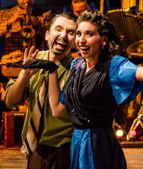

+++
title = 'LaNegraEster'
date = 2026-03-07T12:14:51-03:00
draft = false
+++

No tengo la costumbre de ir al teatro. No suelo buscar algo que ver por mi cuenta; más bien las oportunidades aparecen y a veces las tomo. Esta vez la idea fue de mi esposa.	
Mi primera noción de esta obra fue un video de la actriz Ximena Rivas (para mi la Poncia) cantando una de las tantas canciones que aparecen en la obra, la más reconocida la del zapatero, viendo ese fragmento me cuestioné su origen, solo por un segundo, siendo una conversación de cama con mi esposa de algún día ver esta obra.

En corto, si bien es una obra basada en un recuento o un cuento de un romance de puerto, ver a la Negra Ester es poder oler y escuchar las fotos en blanco y negro de familiares a los cuales de aburrido me metía en sus cajones o álbumes de fotos, recorriendo cada foto tratando de entenderlas, fue poner música a los cuadros antiguos de casas que se resisten a caer.
La obra cumple la promesa de brindarte la historia de manera carismática y emotiva, y esto se ve en su público, que es principalmente mayor, por no decir de tercera edad. Público que ve en la historia de la negra, las vivencias de tíos y abuelos y ponerle música de fondo y brindar un fondo a historias que solo se saben de reunión en reunión, de cena en cena, de velorio en velorios. 
Lo pintoresco y carismático, se puede ver en el maquillaje exagerado y colorido, que pinta sobre el rostro de las personas la vivencia de esta obra como un cuento, más que un hecho histórico, y esto queda evidente en el origen de la obra en la misma música y vida de Roberto Parra.
Ver la negra Ester, es ver de manera cómica o caricaturesca una ventana a una época que las palabras y cartas tenían un peso, donde el dolor y la miseria brindaban a la gente un punto de partida para canciones y acciones, donde, creo se podían ocultar emociones en una tonada; donde el olor a cuerpo se enmascaraba con el olor del vino y donde las historias eran contadas entre vasos de vino y cerveza, donde las canciones permitían expresar muchas veces lo que no valía la pena plasmar en una carta, donde el erotismo a veces se vivía desde lo sutil, una mirada rápida, un juego de ropa o un plan a escondidas.
Siendo mi primer acercamiento desde obras que alguna vez llegaron a mi colegio, me quedo con la nostalgia y el calor de una historia que podría ser la de amigos de mis abuelos, algo no tan lejano, con la picardía de sus personajes y con los estereotipos plasmados, que en su conjunto permiten narrar de una perspectiva alegre la miseria que muchas veces acompaña las realidades que no vemos en el día a día.
El único pero, es que esta historia conecta sólo con su público, el cual vio nacer esta obra en su adultez o infancia,  quizás que pueden recordar la época en la que está basada, público el cual un día puede desaparecer y perder esta conexión. 
Espero, volver algún día a vivirla, esta vez como un público no primerizo que vuelve por la misma nostalgia de este publico antiguo, sentir esa añoranza de una historia que para nosotros es antigua, pero que sigue teniendo sentido incluso ahora, una historia que emana olor a humedad, al frio costero y al calor de sabanas sucias, una nostalgia serena de un mar que vio y ve como miles de historias han ido a parar a sus costas y que algunas se aferran a la arena para no ser borradas por la espuma.

Ricardo V.