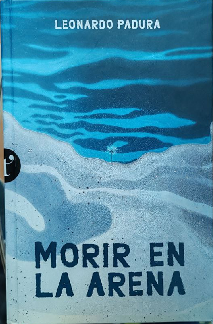

+++
title = 'Morir en La Arena'
date = 2026-03-01T18:55:35-03:00
draft = false
summary= "Libro / Opinión:  Impresiones del libro de Leonardo Padura"

+++

Después de leer Morir en la Arena de Leonardo Padura (mi primer libro del autor) pude poner otra arista o capa a una sensación que poseen las cosas lentas, que se puede apreciar en todo lo que habita la estanqueidad, generalmente lo más destructivo es el paso del tiempo, pero sobre todo el tiempo sobre cosas que no tienen la culpa de ser como son.

La primera sensación del libro (que es un adelanto) es como si la historia avanzara en oleajes lentos, constantes y con un sonido de fondo que no te permite distinguir si vienen más olas o viene una grande, estás parado en una playa sintiendo como tus pies se hunden en la arena cuando el oleaje se retrae, y una sensación de mareo o movimiento súbito e infranqueable te mantiene en posición mientras ocurre; Sentir este libro es ser la roca que es golpeada día a día por el oleaje, ser esa roca que día a día pierde un poco más de sí, donde día a día se convierte en otra cosa que no es roca, y algún día dejará de serlo, es el paso entre la roca y la arena lo que se vive en este libro.

Ahora entrando en tierra derecha, la historia que cubre el libro esta basada en historias reales, con un poco de magia del autor, cómo el mismo dice en el epílogo es un homenaje a su generación a través de una historia que cubre parte y fondo del proceso que vivieron como la juventud que vivió el proceso comunista de Cuba, un homenaje a personas que algún día nadie sabrá de ellas, personas como todos nosotros que algún día solo quedarán en fotos que para quien las mire, no podrá reconocer en ellas algo conocido.
Es un libro denso no en el detalle, si no en que se debe esperar a decantar para saborearlo, como dije antes es un oleaje constante, que a veces cesa, por un instante y es cuando lo cierras, cuando la historia decanta puedes imaginar y sentir esa degradación que se escribe en el libro, y como las pequeñas victorias que se describen ofrecen una soga a la cual afirmarse para continuar leyéndolo. La principal trama ocurre como en la mayoría de las historias, sobre una historia común que dividió a una familia, historia que podemos cambiar la forma y el fondo y podría ser la historia de tragedia familiar que, de alguna forma u otra, directa o indirectamente conocemos, podemos vernos o no vernos en ella, pero la sensación que se obtiene es de un terreno conocido.

No quiero entrar en detalles, pero estoy poco acostumbrado a que en mis lecturas se presenten escenas que pudieran ser descritas de una manera directa, cruda (no en el sentido malo, sino en cómo son en la realidad), en donde el detalle de la acción bien puesta, no degrada el relato y te permite imaginar justo como el autor quiere que lo veas
Finalmente, solo puedo decir que las cosas que se mueven, tienden a morir mejor, tienden a tener un cierre específico, tienden a iniciar y terminar un ciclo, tienden a transformarse en algo más, las cosas lentas ocurren después de que una cosa que se mueve cambia, es el estado final de un proceso que no termina, un proceso en el que el inicio y el fin son solo distinguibles cuándo ha pasado una cantidad descomunal de tiempo, pero no implica que de ellas se pueda extraer algo hermoso, las capas de pintura de una muralla nos muestran como una vieja estructura se niega a morir mientras sea útil para quien la vive, un piso de tierra perderá tierra cuando sea barrido y en algún momento dejará de ser un piso, pero mientras sea tierra firme será hermoso, la languidez de la vejez bien o mal vivida, nos permite acercarnos de manera acorde a la muerte y es ahí donde escogeremos aceptarla, no mirarla o afrontarla, somos seres que se están muriendo lentamente, donde solo podemos ver el avance después de años, donde a veces por instantes, cuando nos detenemos, podemos ver como nuestras manos no son como las recordamos y luego olvidamos cuando volvemos al habito de vivir, somos esa roca que seguirá siendo sometida al viento y el mar hasta que sólo seamos tierra.

Finalmente, solo puedo decir que las cosas que se mueven, tienden a morir mejor, tienden a tener un cierre específico, tienden a iniciar y terminar un ciclo, tienden a transformarse en algo más, las cosas lentas ocurre después de que una cosa que se mueve cambia, es el estado final de un proceso que no termina, un proceso en el que el inicio y el fin son solo distinguibles cuándo ha pasado una cantidad descomunal de tiempo, pero no implica que de ellas se pueda extraer algo hermoso, las capas de pintura de una muralla nos muestran como una vieja estructura se niega a morir mientras sea útil para quien la vive, un piso de tierra perderá tierra cuando sea barrido y en algún momento dejará de ser un piso, pero mientras sea tierra firme será hermoso, la languidez de la vejez bien o mal vivida, nos permite acercarnos de manera acorde a la muerte y es ahí donde escogeremos aceptarla, negarla o afrontarla, somos seres que se están muriendo lentamente, donde solo podemos ver el avance después de años, donde a veces por instantes, cuando nos detenemos, podemos ver como nuestras manos no son como las recordamos y luego olvidamos cuando volvemos al hábito de vivir, somos esa roca que seguirá siendo sometida al viento y el mar hasta que sólo seamos tierra.

Ricardo V.