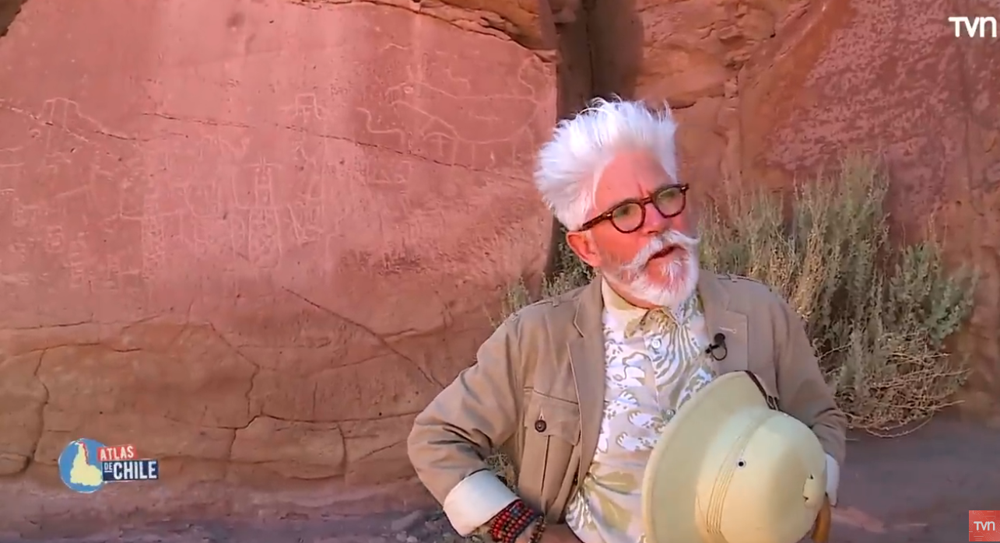
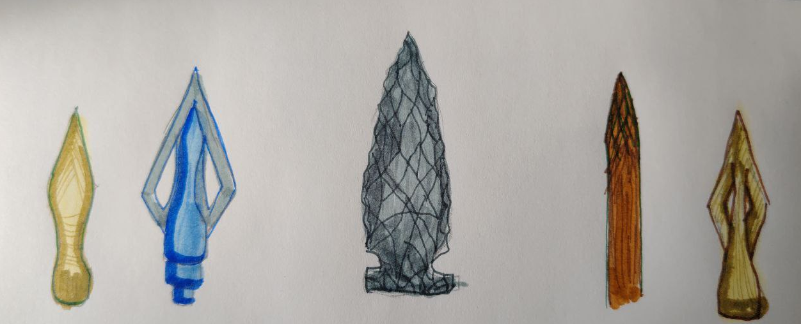

+++
title = 'Primitivo'
date = 2026-03-07T10:48:34-03:00
draft = false
summary= "Intento de ensayo 1:  Ideas con las que se queda uno despues dever TV"

+++

Hace poco me encontré pensando y dando vueltas a una idea viendo Atlas de Chile, cuándo visitaron San Pedro de Atacama, en el capitulo visitaron unas petroglifos en una pared y en el programa Federico, al ver los dibujos, contó la idea de que lo que veíamos en el lugar era algo a mirar con detenimiento, era algo tan humano como nosotros (los actuales) algo que nosotros podemos hacer y los antiguos también, y es plasmar tu universo, tu comprensión de los hechos de tu cultura, de tu vida en un dibujo en una pared.

Eso me hizo pensar en una pregunta: ¿cuán diferentes eran ellos de nosotros en la forma de interpretar la realidad? ¿dónde podría marcar un antes y un después? Luego pensé y recordé los cuentos, las historias, manuscritos que tenemos registros como humanidad que podrían plasmarlo, evidenciarlo. Pero al leer un poco, lo típico: meditaciones, cartas, la biblia (escoge tú) siempre hemos tenido los mismos problemas como humanidad, evidenciados en las historias y mitología que puedo recordar y leer, entonces me pregunte: Si podemos traducir y comprender textos de hace mas de mil años, podemos, comprender la problemática de vida de esas personas, su dolor, su pena, entonces ¿podemos llamarlos primitivos? Hasta donde realmente podríamos decir que la humanidad ha sido primitiva y me lo cuestiono de la siguiente forma. 
Si pudiésemos hacer un ejercicio mental, sin límites de la física como tal, si de la nada apareciera en los años 80, ¿podría seguir viviendo? La
respuesta es sí, quizás desorientado, no entendiendo las normas básicas, la etiqueta, pero podría ser yo y existir 
¿Ahora si retrocediera 500 años, la misma pregunta seguiría vivo? Y la respuesta nunca va a dejar de ser sí. 
Incluso si retrocediera mil años y encontrara otro humano, lo primero sería agradecer su presencia. Mis conocimientos servirían de poco: necesitaría su ayuda para sobrevivir en su mundo. si de alguna forma pudiera congeniar, podría decir que seguiría vivo, dejare fuera la posibilidad de morir por un virus o bacteria que exista en la época y supondré que yo no transporto ninguno. Lo fundamental, es que podría hacer este ejercicio y mientras tenga la capacidad de entenderme con el humano que tengo al frente, tendré la oportunidad de vivir y he aquí mi conjetura: nunca podría decir que son primitivos respecto a mis conocimientos. Mis conocimientos en ese contexto no me salvarían. Necesitaría su ayuda para sobrevivir. La humanidad siempre ha estado en su apogeo tecnológico (salvo la edad oscura), y esto lo concluyo con la capacidad de vivir. 

Podría estar en Roma de Marco Aurelio,  en el amazonas con diversas comunidades, en la sabana Africana aún así, si logro comunicarme y me aceptasen, viviría principalmente por que tienen la capacidad de vivir con su tecnología, quizás no hasta los 80 años pero vivir, agradecería cada avance que tuvieran, netamente por que nos permite vivir. Entonces me pregunto, ¿dónde tiene sentido esa palabra o dónde no? ¿Por qué llamamos primitivo a lo sanguinario de una cacería o de un conflicto entre tribus? ¿Solo por que nosotros, automatizamos el proceso de matanza? Siendo honestos no es tan diferente a lo que somos los humanos del presente.
Si siguiera retrocediendo en algún punto no existirá la agricultura, solo lo disponible en la región, o sea, cazaría y recolección, pero si puedo entenderme con ellos, puedo seguir viviendo. 

Lo anterior suma y sigue, donde podría perfectamente decir que estos humanos son primitivos, si me encontrara viviendo con ellos. La única diferencia , sería mi moralidad transportada por mí al pasado, es lo único que puedo llevar conmigo, nada más, sus modales, formas, prácticas obedecerían a su realidad, que nuevamente estaríamos hablando de su peak tecnológico no importa dónde me pare, mi marco de referencia sería su presente y en cualquier estadio, no los vería primitivos. Esto nos lleva a lo siguiente: ¿cuántos años tendría que viajar para encontrarme en serios problemas?, ¿cuántos años bastarían para no reconocer al humano que tengo al frente?, y ¿cuándo dejaría de ser un humano? 
Si me pongo más quisquilloso, como humano moderno: Si viajase tantos miles de años, y conviviera con neandertales, sapiens o denisovans, podría seguir viviendo con ellos mientras pueda de alguna forma dialogar, la respuesta no cambiaría, sería un rotundo sí, la única diferencia radicaría en lo que entendemos como avances tecnológicos, pero la humanidad siempre ha sido tecnológica, y por lo tanto a la vanguardia de la época, moderna, entonces ¿cuándo podemos seguir diciendo que son primitivos? 
La idea tiene in extremo, y es cuando YO no podría identificarme en ellos, con lo que tengo al frente cuando digamos el humano del frente es mas un animal (en el sentido de la palabra no en salvajismo) que un humano, si esta parado erguido, son un grupo, se preocupan por su clan, tienen un plan basado en las estaciones y tienen herramientas, podría sobrevivir? Acá es donde me detengo, y creo que podría decir que son primitivos si no reconocen en mi un igual o similar, si no logro conectar con ellos y demostrar que somos equivalentes ( no en lo evolutivo) cuando serían primitivos y mi una conclusión, esta mañana de domingo en Notion es cuando ya no me pueda comunicar con ellos, la barrera final seria en el lenguaje, y acá mi ejercicio mental podría perder sentido. Como demostrar que el humano que tengo al frente puede tener simpatía por mí, en reconocer que lo que tiene al frente es un humano, que tiene un clan, un nombre y años de vida, ¿cuál es la barrera en donde a pesar de que pudiésemos llorar ambos la pérdida de alguien cercano, entre ambos sería un dolor ajeno. Ahora que lo escribo, me hace sentido práctico, la idea que seguimos siendo primitivos, aún ahora, siendo capaces de poder conversar y establecer un vinculo con la otra persona, prácticamente sin limites físicos a nivel terrestre, seguimos separados por una capacidad heredada a nivel conductual que no nos permite abrirnos al otro, el miedo de la tribu ajena, sigue ahí, entonces me pregunto, si no somos tan diferentes de las tributos de hace mas de 12000 años, con que derecho nosotros podemos llamar primitivos a nuestros propios contemporáneos. 

Termino con esa pregunta, ¿donde y cuándo la modernidad comienza? Yo diría cuándo pudimos plasmar nuestro mundo en una pared

Ricardo V.

