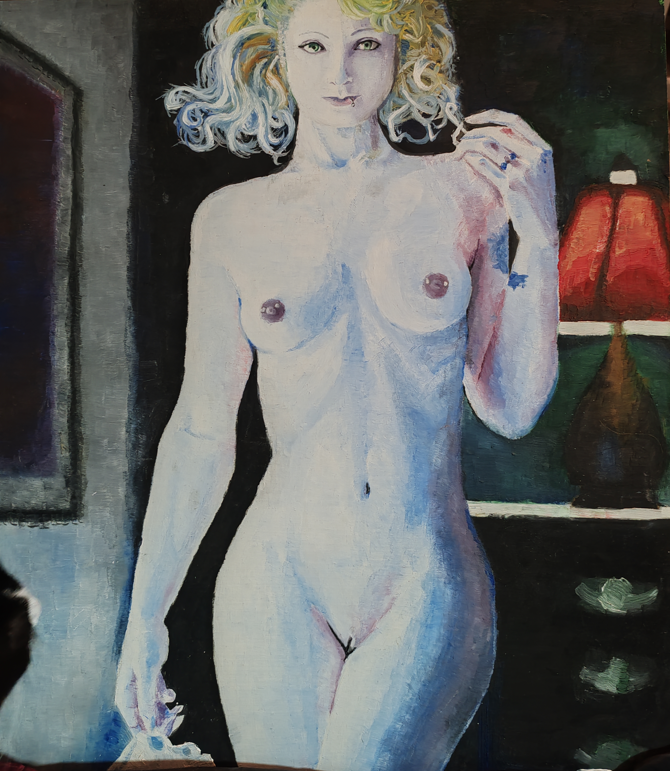

+++
title = 'Reencuentro'
date = 2026-03-07T12:39:06-03:00
draft = false
summary= "Ejercicio reflexivo:  Cuándo un hobby te mira de vuelta"

[params]
  license = "cc-by-4.0"
  rights = "© 2026 Ricardo Vivanco C. CC BY 4.0"
+++

*¿Qué ocurre cuando ves un viejo hábito y este te mira de frente?* 

*Para mi el relato de alguien que ya no existe o que no volvio,  o alguien que debe volver a subirse a la bicicleta y sentir el movimiento.* 

*Veo esta pintura y ahora puedo notar sus fallas, donde me concentre en pintar, donde no,  donde perdí las perspectivas de las partes y donde no.* 

*Errores anatómicos: una clavícula fuera de lugar, hombros tanto mas grandes que la cadera, diferentes puntos de fuga desde el ombligo hacia arriba y hacia abajo.* 

*Pero, de alguna forma, algunas partes las considero hermosas, donde puedo recordar perfectamente por que me enamore de la técnica.* 

*Puedo ver los miles de trazos que me gritan que disfruté el proceso, doloroso inclusive.* 

*Puedo ver donde me perdí solo pintando e incluso partes que me fascinaron posterior a terminarla.* 

*Ver este hobby me recuerda por qué pintaba para mí y no para el resto.* 

*Cuando pintaba para el resto se transformaba en una tarea.* 

*Cuando pintaba para mi, era solo pintar.* 

Ricardo V.

