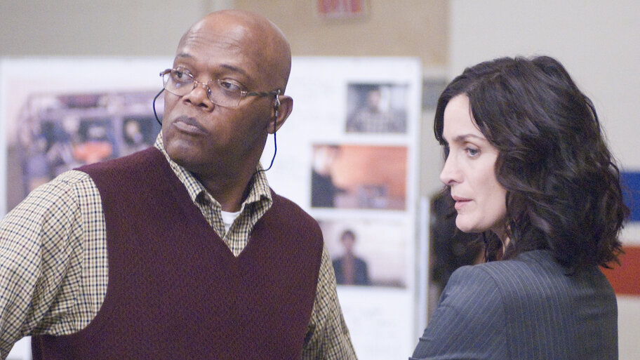

+++
title = 'Transgresion'
date = 2026-03-07T11:51:27-03:00
draft = false
+++
### Transgresión

Hay pocas películas que puedo decir que son desagradables de ver. No porque lo que muestran esté fuera de la raya, sino porque nos obligan a cambiar la palabra “moral” por “sistema”, y hasta cierto punto eso tiene sentido.
Comenzaría con preguntas del estilo: ¿Hasta dónde podemos defender nuestro sistema? Y por sistema, me refiero a lo que sea que nos construye un relato en el cual sentamos nuestra identidad y con eso darle sentido a nuestra realidad y con ello otra pregunta, ¿el sistema en el que nacimos debería evitar que lo defendamos? o mas bien por que hasta donde pueden tirar los hilos del sistema la concepción de lo que creemos que somos como personas.
Pero lo llevaré a una pregunta más simple, ¿por qué aceptamos de buena o mala manera que el sistema genere lo impensable? Para mí la respuesta es: cuándo lo malo es llevadero sólo si le ocurre a otros.
La película Unthinkable me recuerda a libros como Cobra de Frederick Forsyth. Llegaré a ese punto más adelante.
Unthinkable nos sienta en un escenario donde todo puede salir mal: la amenaza de una bomba. Relato un tanto comercial o de película cartelera con escenas siniestras, pero estas escenas son mucho mas cruentas de ver que el cine de terror, y se debe justamente a que nos presenta la tortura sin tapujos, nos deja ver escenas de tortura militar, tácticas de obtención de información, procedimientos establecidos y una jerarquía de procesos para destruir a una persona que intenta atentar contra el sistema.

### La película

Bajo esta premisa, la historia se desenvuelve en cómo detener lo inevitable sin dejar de ser humanos, pero la otra cara de esta premisa es: “sin mancharse las manos”, y aquí es donde el conflicto aparece. De la mano de Samuel Le jackson y Carrie-Anne Moss, ellos se nos presentan a los espectadores como las cartas del sistema, Samuel Le Jackson como “se hace lo necesario” versus  Carrie-Anne “se hace lo necesario con protocolos” o en otra abstracción, “La herramienta del sistema” y “el sistema”, ambos turnándose para realizar el proceso de quebrar a una persona que cae en condición de terrorista, por crear un chantaje (mediante bombas atómicas ocultas y en cuenta regresiva) solicitando una serie de requisitos para desactivarlas y aquí nace lo interesante o de donde se plantea la pregunta de todo el post y la película, el terrorista (Michael Sheen) brinda una los requisitos para desactivarlas es la salida de Estados Unidos de territorios bajo ocupación y acá es donde comienza el conflicto, el sistema (en este escenario) jamás entraría en esa salida a menos que compruebe que la amenaza sea real y si es real, lo que plantea la película, es que realizará todo lo necesario para no aceptar, negociar, un juego del gato y del ratón donde el sistema juega a que esta interesado, pero en realidad busca ganar tiempo para tener control. El quiebre viene de la mano de Samuel L. Jackson, al cual se le asigna la tarea (bajo mando) de obtener de toda forma posible la información de las bombas y tal como se presenta en la película, la misión es sin moral, sin enemistad, las partes involucradas no se odian, no existe un repudio por la persona, su religión o color de piel, esta “solo” la misión, sin importar los costes personales, en otras palabras la tortura, y esta se ejecuta entre una danza entre Samuel y Carrie-Anne, danza que cambia entre tortura y negociación, entre reconocimiento del cruce de la línea y de como volver a una situación con control, entre crueldad utilitaria y el cuestionamiento de lo que el sistema permite en estos casos y acá es donde puedo citar a Frederick Forsyth. 

### EL fondo

Devolviéndonos un poco al dilema de la película, y las preguntas que planteo al principio: para el sistema, el horror vive afuera del sistema, vive en el enemigo publico y ese enemigo se crea bajo las reglas que dictan quienes son del sistema y quienes no, dictan por así decirlo, occidente versus oriente, nosotros versus ellos o nuestro país versus el resto de países y dado lo anterior, el relato de lo que somos y como podemos mantener lo que somos como sistema, define que la violencia se viva fuera, la violencia externa se justifica para mantener el sistema y si es interna no se reconoce, y cuando esta aparece, se niega o se atribuye a eventos externos que se colaron en el sistema, por lo que sistema genera un relato donde defiende y ejecuta actos para que este tipo de horrores no ocurran dentro del mismo y el “incurrir” es justamente el área gris donde lo que definimos que somos y lo que proyectamos al exterior es donde vive el mito de que el sistema es el bueno, generalmente lo es.

### EL dilema

Para Frederick Forsyth en el libro Cobra, el personaje principal explica en un enojo posterior a que cancelaran su plan maestro (en el libro), que el sistema  plantea que el discurso del problema de la droga es un problema externo y se plasma en cómo se combate fuera del país, en donde nuestro problema es que el exterior invade nuestro sistema y lo expone, y se combate fuera para no exponer nuestra propia debilidad, el sistema dice que el problema es externo, pero cuando se ataca y se hace evidente, la violencia aparece dentro, justamente esto, el enemigo externo, pasa a ser interno, es nuestro propio sistema que colapsa y cambia el discurso que lo mantiene en línea y Unthinkable nos muestra justamente como se mantiene este discurso, como ese discurso permea tanto en los habitantes del mismo, que la estructura moral de los protagonistas que no son Samuel Le Jackson, o Henry, protestan por la tortura realizada por este personaje, que sabe justamente que el sistema no se ensuciará las manos para obtener la información, sabe que el problema radica en lo que pensamos que somos cada uno, y sabe que el sistema puede autorizarlo para lavarse las manos, que se puede expresar como un inverso del proceso del discurso, y se plasma en hasta que punto el sistema puede permitirse desentenderse del discurso, esa área gris de lo que definimos como frontera de lo bueno y lo mano, lo podemos mover a gusto. Henry sabe perfectamente que el sistema no lo permitirá. Pero también sabe que no querrá verse involucrado, su existencia como personaje de la historia,  es la justificación de la frase “No negociamos con terroristas” en acción y de esta forma, la historia se desenvuelve en como cada personaje de la historia cede al pánico y a mover la línea de lo conveniente, y con ello la sensación nauseabunda de que lo permitido se puede justificar si así se requiere. 
Al final, el sistema ¿gana? de una forma definitiva pero no sin consecuencias, gana exponiendo el limite personal de cada personaje hasta un punto en que se cuestionan sus propios valores, hasta un punto en que permitieron que ocurrieran cosas impensadas, permitieron y juzgaron que el sistema puede permitir que una vida pueda ser cambiada por millones, pero las personas que tomaron la decisión jamás se enfrentaron al proceso, y toda la conciencia de los actos cae en el peso de las ordenes recibidas y cuando estas ordenes dejan de ser una orden y se convierte en supervivencia. La conclusión general para mi (inspirada también en ideas del libro Predeterminado de Robert Sapolsky.) uno no escoge nacer en un contexto especifico, se forma con el, y para los que vivimos en este sistema, todos podemos defenderlo sin intentar mejorarlo, porque “es lo que es”, y nada más, dado lo anterior, todos somos el sistema, incluso lo defendemos por que no existe alternativa mejor (cualquiera de las ya existentes) pertenecemos y lo defendemos hasta que este nos usa o abusa y acá viene el origen de las revoluciones.

### Sensaciones finales: 

Esta película cuando la termine de ver la investigue un poco, tratando de entender por que no fue taquilla o al menos mas vista, y recordé que en varias oportunidades me tope con clips de la misma, de una escena en especifico en donde Henry se liberaba del FBI por ser un protegido del sistema, lo cual me cuestiono ahora, por que esa precisa escena tiene mas cabida que todas las otras de la película en las redes sociales, lo único que puedo pensar es que es “el *Winer*” o “el ganador” el intocable, precisamente esa escena es lo que se quiere vender, sólo la sensación de ganar al sistema,  se tomo un fragmento sólo para venderlo como una mini película en donde el sistema pierde, como si lo que se quisiera vender en el algoritmo, sea la sensación o la satisfacción de ganarle al sistema, de ponerlos en su lugar, una emoción visceral, que no permite reflexionar, que no permite sentar y pensar un rato todo lo que no se ve y que ocurre sin nuestro conocimiento.

También encontré varios comentarios de que la misma película es propaganda, y en cierto modo lo es (mueca de yyyyyyyyyyyyyyyyyyyyy siiiiii lo es) debido a como presentan el escenario y el extremismo y estoy de acuerdo con esa postura, y para mi entender, es mas fácil y digerible esa historia para el público que fue creada, que otra historia un poco mas inverosímil. Pero si había mas formas de crear esta historia y me recuerda a la película John Q  en la cual un padre (Denzel Washington) en un conflicto de no poder pagar por la operación de su hijo secuestra al sistema, forzándolo a negociar con sus demandas, esta versión por si misma, podría ejecutarse en otras escalas para presentar este dilema, de una manera en el que el problema era en sí el sistema.

Para cerrar, no la vería de nuevo netamente porque la actuación de Michael Sheen (que lo conocí primero por otras series) realmente te deja con una sensación nauseabunda de lo que vive, siendo incluso el “enemigo” de la película.