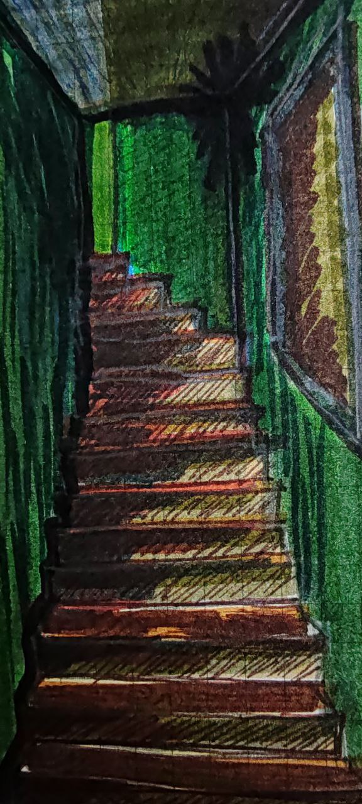

¿Cuándo todo se hace chico y viejo?  
¿Cuándo es que uno despierta por un pequeño momento? solo para tener un breve lapso de humildad y entender que todo ha cambiado  
¿Cuándo comienza y termina mi viejo y nuevo yo?  
¿Cuándo decir estoy grande o viejo? Si ni siquiera las cosas que te hacen grande te dividen en dos  
Solo vasta volver a ver una vieja escalera olvidada, para sentir que olvidaste como caminarla y como sonaba.  
¿Quién nunca más volvió a subir y a bajar esa escalera a la que alguna vez llamé casa?  
Y Quien es el que escribe estas palabras que al ver esa escalera las nota pequeñas, delicadas y en tono sepia.  
Como es posible que al que llamo yo, no pueda dividirlo en etapas, distinguirlo por segmentos, como si solo fuera un hilo que jamás cambia pero se va decolorando, un largo hilo que al final solo se terminará degradando.  
Esas escaleras las sentí pequeñas, como si las pisadas que las pueden subir y bajar fueran de un niño o un joven al cual no puedo acceder.  
Un recuerdo que percibo como fantasmas que llevo conmigo hasta que un día no pueda a volver a subirlas, sea por que no existan o nunca mas pueda volver a ellas.
