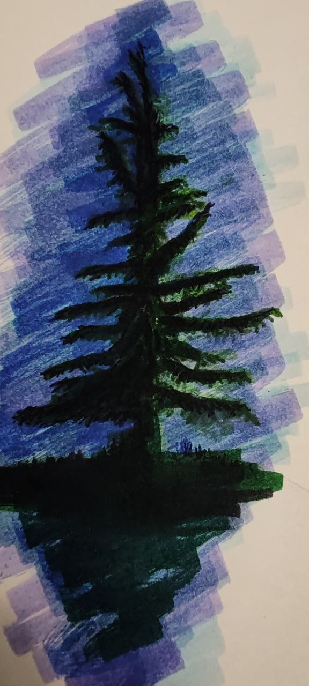

Si no tuviera un camino que seguir  
al menos tengo un árbol un pino fuera de la casa de mis padres  
afuera siempre estuvo, desde que tengo memoria, marcando el mismo punto, un pino en la ventana a mi derecha.  
Alto con una nostalgia dulce, con su soledad verde gris, con su compañía solitaria.  
Como un norte cercano que como brújula viva siempre me muestra donde estoy. Como una fotografía vieja en mi pantalón, la cual un día usaré para volver a reconocer algo que en su tiempo olvidaré.  
Incluso donde sea que no sea mi hogar, veo copias de esta brújula, solitarios, firmes, marcando un norte entre nortes, un camino sin destino claro, brindándome tranquilidad.  
Como marcas en el camino que me permitirán saber cuánto he avanzado, olvidado y dejado atrás.
