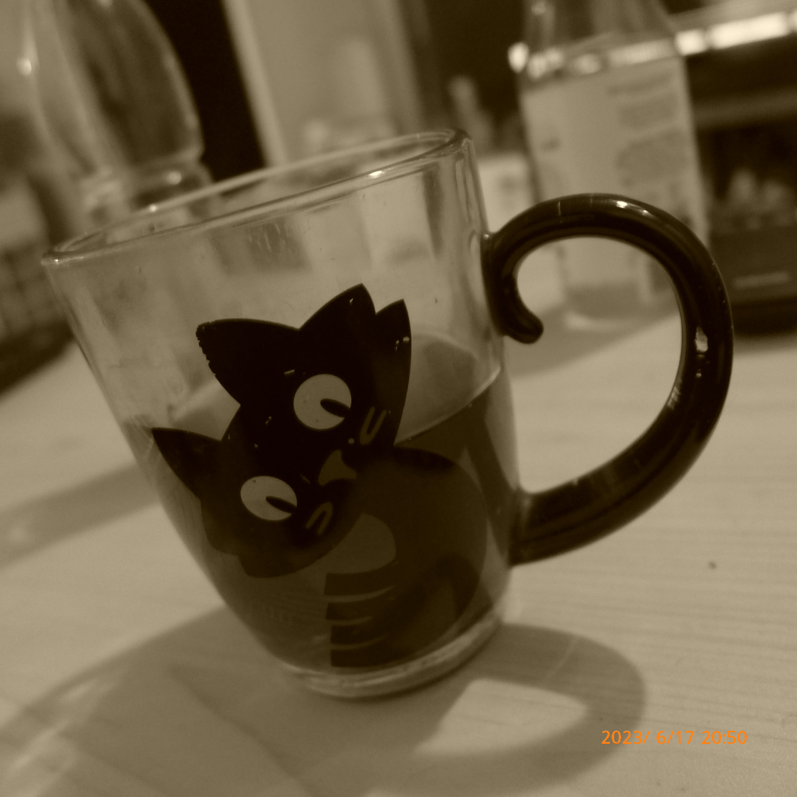

Arrodillado en un banco de madera  
cuando la misa lo pide hacer  
por mi culpa por mi culpa

recuerdo a ese niño pensando en su propio mal  
existiendo en mi recuerdo  
vivo en aquel pasado

rezando con su mundo pequeño  
por mi culpa por mi culpa

recordando que no fue mucho el mal que hacia  
pero el mundo le hacia ver que sí

ojala pudiera decirle  
que de grande somos peores

por mi culpa por mi culpa  
por mi gran culpa

Pero ese niño lo olvidará  
apenas salga de la misa

Correrá de vuelta a casa  
jugará con los mismos juguetes

hasta que lo vuelvan a retar
