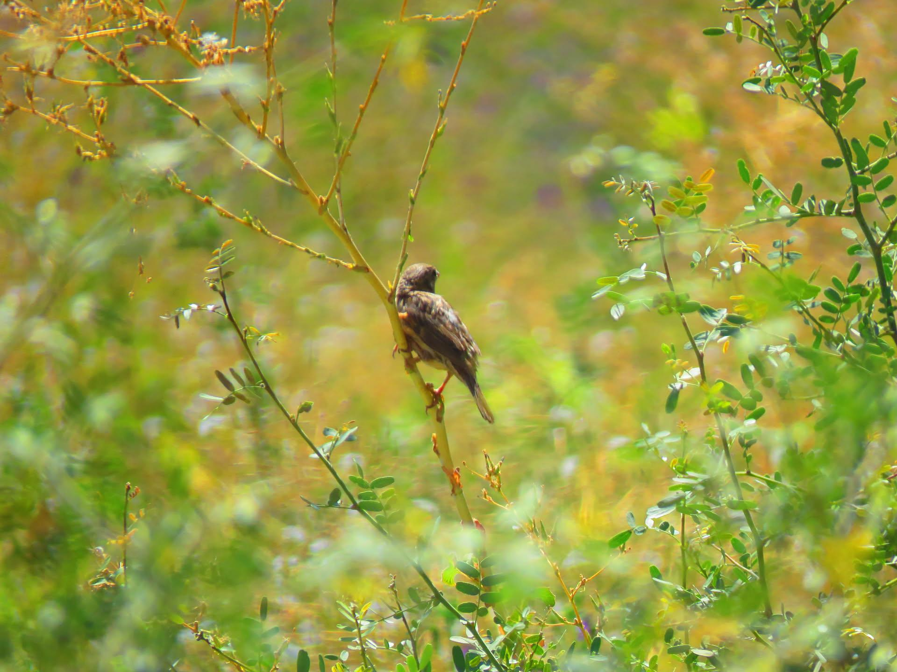

Habito un bosque de flores y arboles donde  
entre piedras y espinas conocí una rama que creció con hojas podadas.  
La veo desde el árbol al que me recuesto y cobijo.  
Veo esta rama buscar al sol entre fuegos, orugas y piedras.

Cada vez que puedo me permito su compañía  
Verla florecer me permite creer que puedo amar de mas de una forma.

Ahora a lo lejos la veo un árbol en camino a la luz

La miro desde mi árbol como se transforma en el mismo sol
