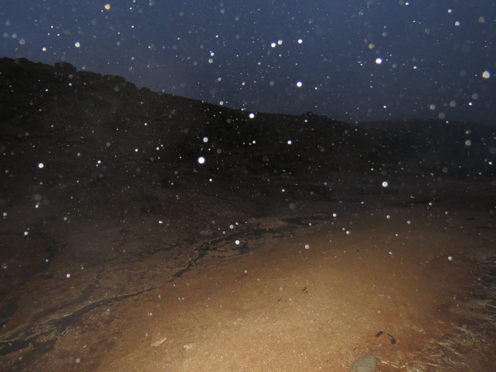

Flotando con miedo, motas de polvo viajan a la deriva en el aire  
curiosas son cuándo atraviesan un rayo de luz en una pieza oscura  
podemos verlas brillar todas juntas habitando ese espacio, delicadas a merced del viento  
Sonrío al verme en ellas aferrándonos a la nada tratando de no ser llevados hacia el fin de la luz  
todas tratando de extender ese segundo que falta para verlo todo  
ese segundo infinito antes de dejar el rayo de luz
