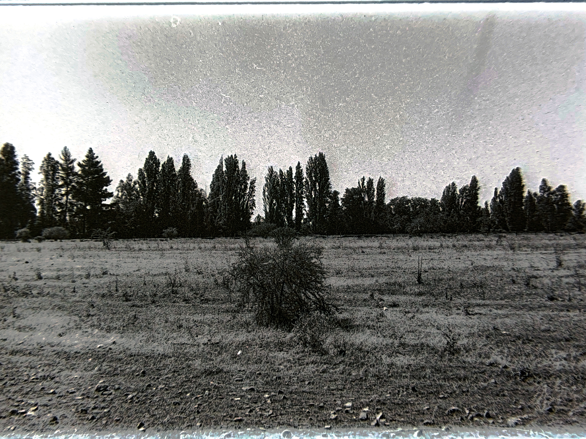

En la distancia suficiente, entre el límite y yo, a través de un llano que invita a parar, veo el mismo viento que siento en mi piel mecer unos álamos  
Imagino estar al lado de ellos en una sombra fría pero en paz  
imagino el ruido a sus pies del viento que los mueve, y puedo sentir el silencio de su sonido sin estar allí  
siento e imagino esa sombra que conozco de otros lugares, sombra que en sus pies descansa, un camino polvoriento con piedras sueltas  
un camino polvoriento, con polvo que no se levanta con el viento, más bien cae y mantiene el silencio  
así imagino esa calma de un recuerdo inventado bajo la sombra de ese viento  
una evocación que miro a lo lejos de donde están esos árboles y de donde me siento a mirarlos.  
Lejos de donde están, imagino el ruido y esa fría sombra a sus pies, y en este estado, mis demonios se sientan a contemplar en silencio lo mismo que yo.
