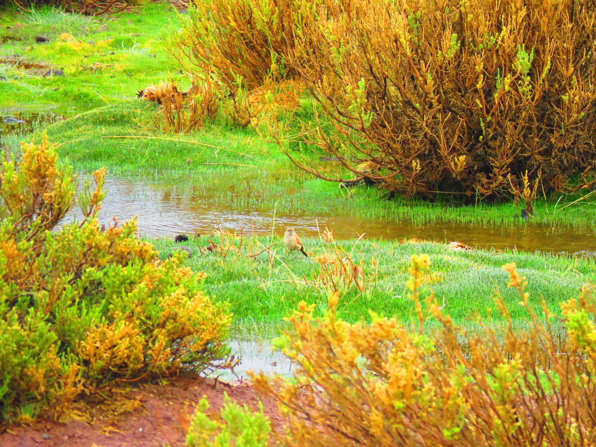

Hay un olor que me sigue, no se de donde viene.  
Un aroma de hábitos olvidados que emanan cuando estoy lo mas quieto posible.

El olor de la vida o de la estanqueidad  
Necesito moverme pero se que aparecerá, ese aroma viene con el.

Un demonio que comparte cuerpo conmigo,  
Un transformista de intensiones, ilusiones y diálogos que se escuchan cuando el silencio reina  
Que no conforme con aparecer y emanar su presencia  
Disfruta conmigo las mismas cosas, dialogamos de las mismos temas y tomamos té a la misma hora

Solo el viento se lo lleva a un lugar que creo se parece a un humedal,  
con pájaros, mujeres, cuentos y reinos

a ese lugar que existe entre pensamientos.

pero la verdad ambos disfrutamos del viento  
ambos vemos las mismas cosas  
ambos emanamos ese olor
