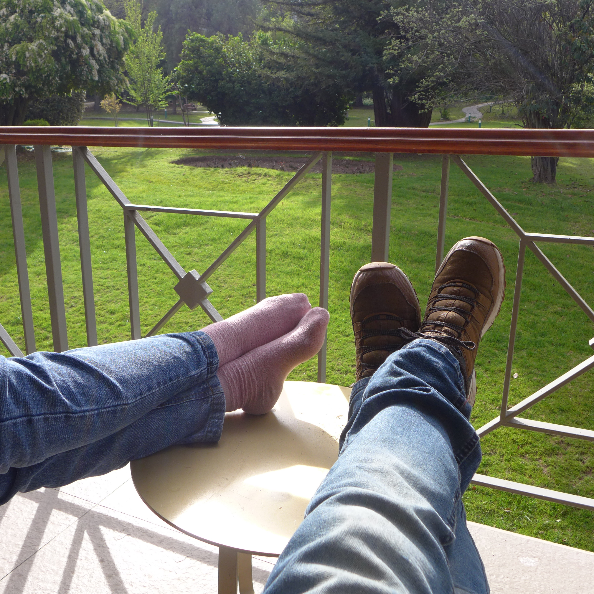

En la unidad mínima del tiempo que existe en una mirada furtiva, en el tiempo que una tela deja entrever o en un reflejo mal ubicado

Puedo decir que compartimos cuerpos con solo estar cerca

Donde colores chocan rebotando entre pieles que están lejos  
y juguetones fotones en la infinidad de tiempo que tienen rebotan entre pieles,  
compartiendo cuerpos en una extraña intimidad fantasmal.

Adornando las formas que necesitan alguien que las mire para darles sentido, poniendo colores donde no los hay

hoy a la luz, fantasmas hacen el amor en una guerra energética de luces que rebotan entre dos manos que solo se sostienen entre si al caminar
